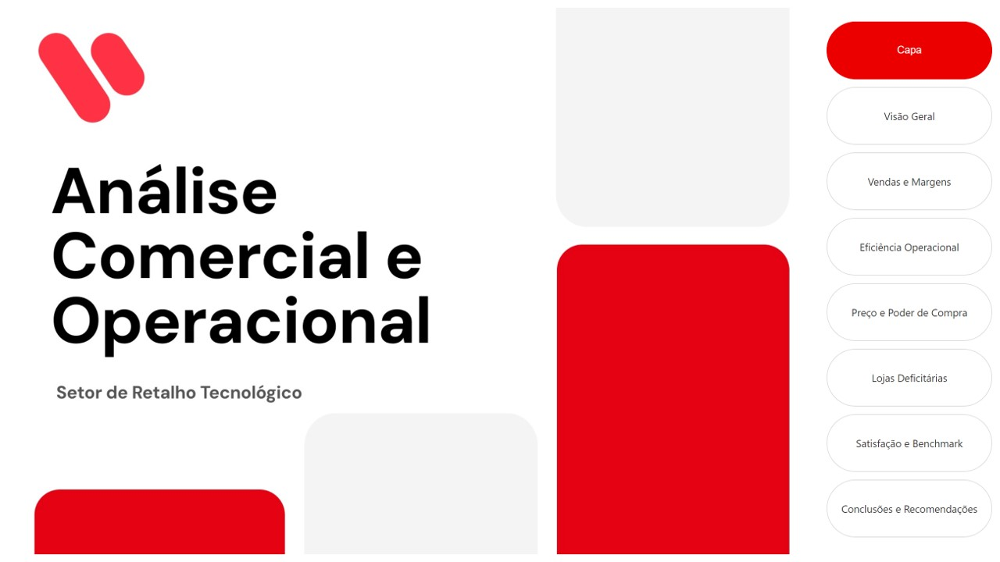
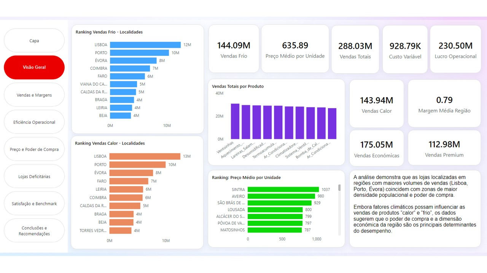
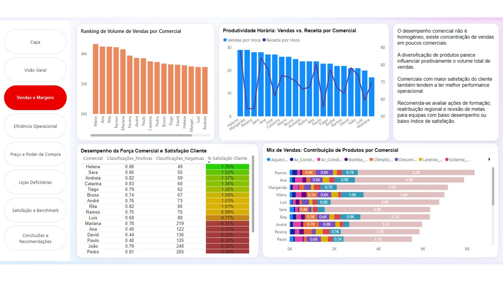
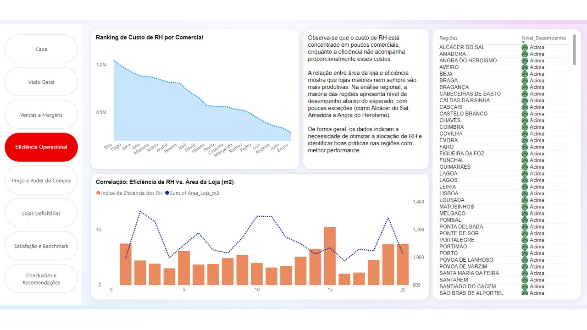
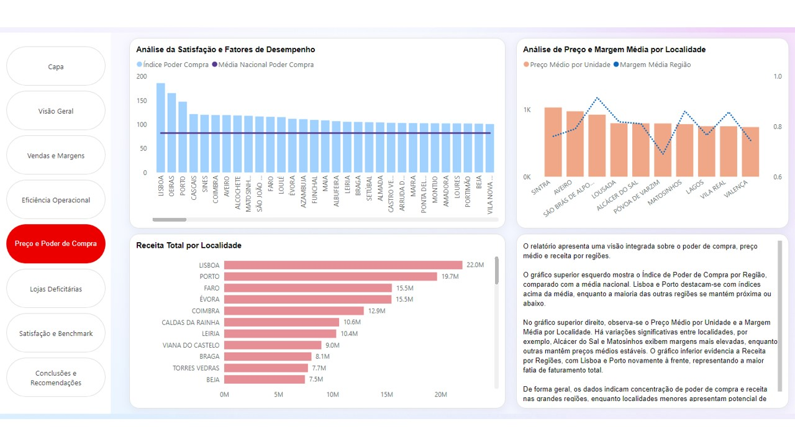
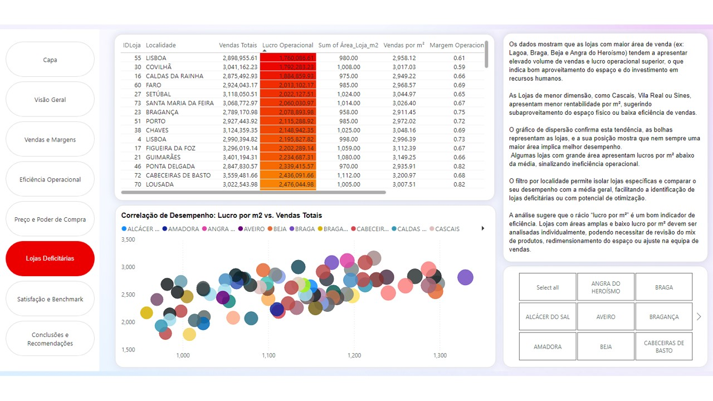
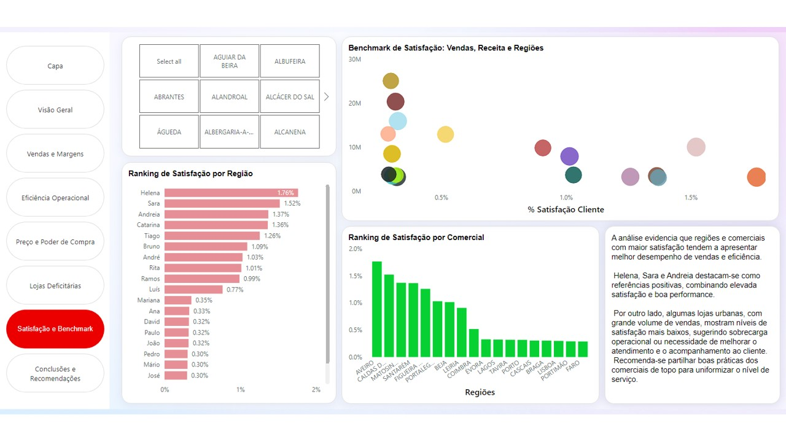
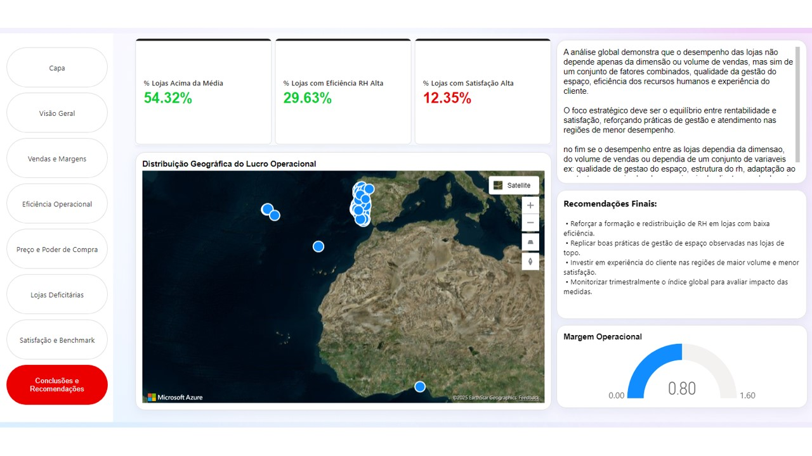

# 📊 Retail Performance & Operational Analysis  
### Power BI Dashboard | Tech Retail Sector  

This project presents a comprehensive **Power BI dashboard** designed to analyze commercial and operational performance within the tech retail industry.  
It explores sales dynamics, efficiency indicators, and customer satisfaction to identify actionable insights that support strategic decision-making.

> ⚠️ Dashboard visuals are displayed in Portuguese (original dataset language), but all documentation is in English.  

---

## 🎯 Project Overview  

**Goal:**  
Provide a data-driven view of store performance by integrating commercial, operational, and satisfaction metrics.  

**Key Questions:**  
- Which regions and stores drive the highest sales and margins?  
- How does operational efficiency correlate with profitability?  
- What patterns emerge in pricing and customer purchasing power?  

---

## 🗂️ Table of Contents  
1. [Overview](#overview)  
2. [Sales and Margins](#sales-and-margins)  
3. [Operational Efficiency](#operational-efficiency)  
4. [Price and Purchasing Power](#price-and-purchasing-power)  
5. [Underperforming Stores](#underperforming-stores)  
6. [Satisfaction and Benchmark](#satisfaction-and-benchmark)  
7. [Conclusions and Recommendations](#conclusions-and-recommendations)

---

## 🧩 Cover  

---

## 📈 Overview  

Provides a global view of total sales, average prices, variable costs, and operational profit.  
Highlights **Lisbon, Porto, and Évora** as key cities with higher population density and purchasing power.

---

## 💰 Sales and Margins  

Analyzes sales performance by salesperson, hourly productivity, and product mix impact.  
Identifies opportunities for **training and regional redistribution** based on customer satisfaction insights.

---

## ⚙️ Operational Efficiency  

Assesses HR cost per salesperson and the relationship between **store area and productivity**.  
Reveals opportunities to optimize resource allocation and replicate best practices across top-performing regions.

---

## 💸 Price and Purchasing Power  

Explores purchasing power by region, average price per unit, and operating margin.  
**Lisbon and Porto** stand above the national average, showing strong revenue potential.

---

## 🏬 Underperforming Stores  

Identifies stores with **low profit per m²** and visualizes correlations between area, total sales, and efficiency.  
Supports decisions related to space optimization, product mix, and HR adjustments.

---

## 😊 Satisfaction and Benchmark  

Compares **regional and salesperson performance** based on customer satisfaction and sales metrics.  
Highlights top performers (Helena, Sara, Andreia) and recommends sharing their best practices across teams.

---

## 🧭 Conclusions and Recommendations  

The dashboard integrates **financial, operational, and satisfaction** dimensions for a holistic performance view.  
**Key recommendations include:**  
- Reinforce training and HR redistribution in low-efficiency stores  
- Replicate best practices from top-performing stores  
- Invest in customer experience in high-volume, low-satisfaction regions  
- Monitor key indicators quarterly to measure improvement impact

---

## 🧰 Tools Used  
- **Power BI Desktop** — data modeling, DAX measures, visualization design  
- **Excel / CSV** — data source  
- **Power Query** — data cleaning and transformation  
- **GitHub** — project documentation and version control  

---

## 👩‍💻 Author  
**Marina Maia**  
📍 Data Analyst
📅 October 2025  

> © 2025 Marina Maia — All rights reserved.  
> This project is displayed for portfolio purposes only.  
> Reuse, redistribution, or modification without permission is prohibited.  

---

